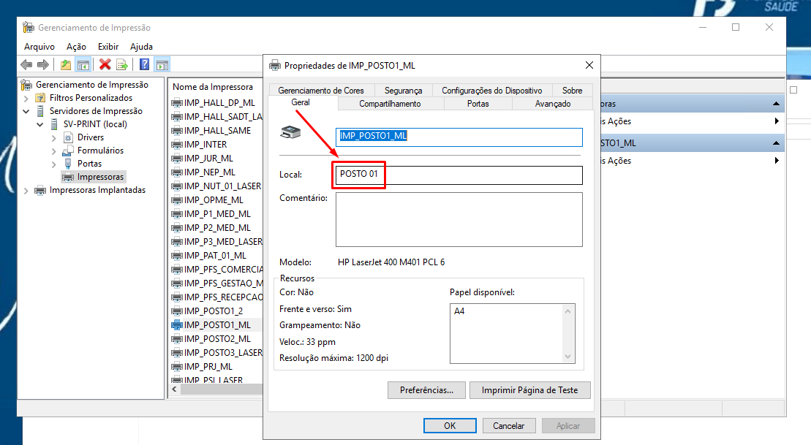
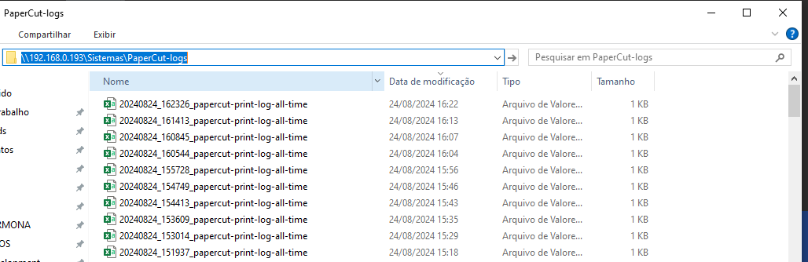
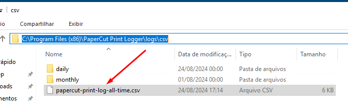

# Solução interna para realizar uma auditoria de impressão no servidor de PrintServer.

Para complementar a inserção de dados no banco, utilizo o software gratuito da PaperCut (https://www.papercut.com/pt-br/). Embora ofereça informações básicas de auditoria de impressão, ele se limita a gerar um arquivo .csv a cada impressão no servidor e não possui suporte para banco de dados ou criação de indicadores. Devido ao alto custo das soluções automatizadas, a empresa optou por não investir em software pago. Assim, decidi desenvolver uma solução gratuita que possa automatizar a auditoria e gerar indicadores relevantes para a empresa juntamente com a separação de Centro de Custos.

**- Configurações:**
- O código deve ser executado em um servidor de impressão Windows como administrador. Pode ser ajustado via Agendador Tarefas, executado por um período de tempo que se enquadra com sua realidade.
- Deve ter um banco de dados Postgres já funcionando.
- Python 3.12 deve estar instalado no servidor.
- Configurar corretamente o Local da impressora para cada impressora no PrintServer, deve estar igualzinho ao `namecdc` cadastrado na tabela CenterCostPrinters no banco.


- Criar uma pasta para receber as cópias dos arquivos novos para guardar no banco. No meu caso foi (\\192.168.0.193\Sistemas\PaperCut-logs\):


- Configurar as variáveis de ambiente dentro servidor conforme a descrição abaixo para o seu databank:
  ```bash
  DB_HOST = ''
  DB_NAME = ''
  DB_USER = ''
  DB_PASSWORD = ''
  ```
- Criar as tabelas no banco de dados
  
**printJobs:**
  ```sql
    CREATE TABLE printJobs (
    id SERIAL PRIMARY KEY,
    cdcid INTEGER,
    timedoc TIMESTAMP NOT NULL,
    username VARCHAR(255) NOT NULL,
    pages INTEGER NOT NULL,
    copies INTEGER NOT NULL,
    printer VARCHAR(255) NOT NULL,
    documentName VARCHAR(255) NOT NULL,
    clientPC VARCHAR(255) NOT NULL,
    paperSize VARCHAR(50),
    languageMethod VARCHAR(50),
    height VARCHAR(50),
    width VARCHAR(50),
    duplex VARCHAR(50),
    grayscale VARCHAR(50),
    fileSize VARCHAR(50),
    FOREIGN KEY (cdcid) REFERENCES centercostprinters(id)
  );
  ```
**CenterCostPrinters**
```sql
CREATE TABLE centercostprinters(
	id PRIMARY KEY,
	namecdc VARCHAR(255) NOT NULL,
	gestao VARCHAR(255) NOT NULL,
	status BOOLEAN NOT NULL
);
```

Caminho do arquivo gerado pelo PaperCut pela instalação padrão: C:\Program Files (x86)\PaperCut Print Logger\logs\csv\papercut-print-log-all-time.csv


## Funcionalidades

Este código ele faz a conexão com um banco de dados Postgres, se conecta ao WMI(Windows Management Instrumentation) do servidor de impressão. 
Busca pelas informações de impressoras instaladas no servidor, verifica pelas tabelas `printJobs` e `centerCostPrinters` se o Local da impressora retornado para cada nome de impressora é igual ao `cdcid` da tabela `CenterCostPrinters` se for igual, é setado o ID do Centro de Custo juntamente com os dados que irão para a tabela `printJobs`.

Como o ID está referenciado a tabela de Centro de Custo, é possível criar indicadores e separar por Centros de Custos suas atividades para auditoria.

**1. Clone o repositório:**

```bash
git clone https://github.com/igorcarmona-git/CSVtoDB_PrinterAudition.git
cd CSVtoDB_PrinterAudition
```

**2. Instale as dependências:**
`pip install pywin32 pandas psycopg2`

**3. Como executar:**
- Agendar no Agendador de Tarefas do windows com privilégios de administrador.
- Executar conforme sua necessidade

## Contribuição
Contribuições são bem-vindas! Sinta-se à vontade para abrir issues ou pull requests para melhorar o projeto.

**Para mais informações, entrar em contato via redes sociais.**
